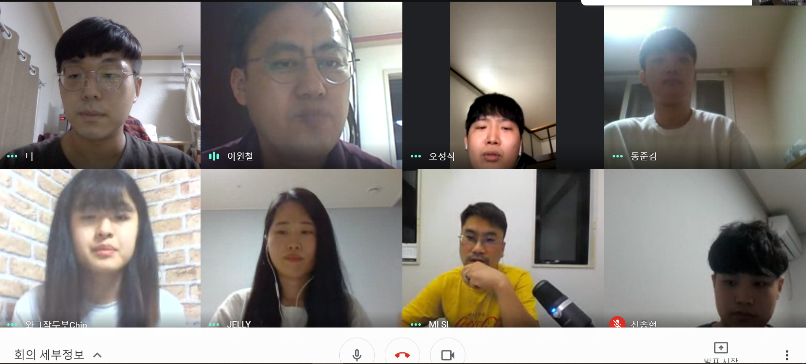
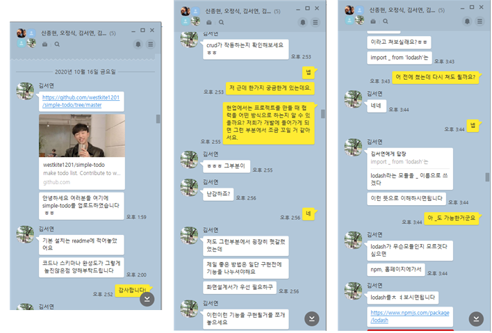
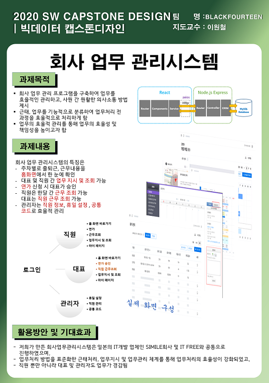

# 2020 2학기 캡스톤 디자인 (한림대학교 소융대)
# 회사 업무 관리시스템 (Company Work Management System)
## 참여자
- 김경민 (팀장)
- 김동준
- 신종현
- 오정식
## 지도교수
- 지도교수 : 이원철 (한림대학교 소융대)
## 과제 개요
- 회사 업무의 효율을 위한 웹 시스템 개발
## 도움 기업 및 자문
- 씨밀레 / 박의일 대표
- IT프리즈 / 정재관 대표
- 디지캡 / 김서연 사원
## 진행 사항
- 9월 2일 : 카톡 단톡방 개설 및 과제 내용 공유

- 9월 7일 : 매주 모여서 공부하기로 계획(화상채팅을 이용한 모임)

- 9월 8일 : 프로젝트를 위한 깃허브 페이지(https://github.com/blackfourteen2014)

- 9월 9일 : 프로젝트 분석 및 발표자료(https://github.com/blackfourteen2014/Project-AnalysisPresentation)

- 9월 11일 : 일본 기업 씨밀레와 첫 화상 회의 (매주 목요일에 단체 회의를 하기로 함)

- 9월 16, 23일 : 모바일 개발 트렌드와 리액트 및 node js 강의
(회의록 : https://github.com/blackfourteen2014/meeting_log)

- 10월 15일 : 지도 교수님과 면담을 통해 미들 서버를 Spring -> nodejs로 변경

- 10월 15일 : 업무관리시스템 설계 완료(https://github.com/blackfourteen2014/Project-System-Process)

- 10월 16일 : 디지캡 사원 김서연 님에게 React, nodejs, DB 연동에 관해 자문을 구함

- 10월 29-30일 : Big Data Capstone 중간 발표회 포스터 제작 및 토의

- 11월 1일 -> 현재 : 개발 중 (깃허브 저장소 : https://github.com/blackfourteen2014/CD_Project)

